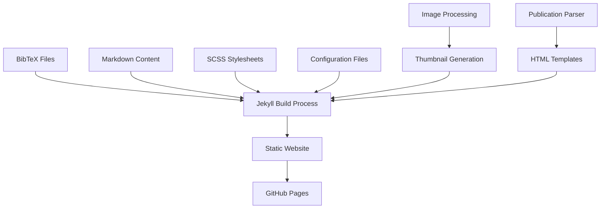

# Design Document

## Overview

This design document outlines the comprehensive redesign of an academic profile website built on Jekyll and the academic.github.io template. The redesign focuses on creating a professional, PhD-style interface with a sophisticated black color scheme, automated publication management through BibTeX files, and enhanced user experience with thumbnail previews and improved navigation.

The solution maintains Jekyll's static site generation capabilities while implementing modern design principles, automated content processing, and responsive layouts optimized for academic professionals.

## Architecture

### High-Level Architecture



### Component Architecture

The redesigned website will consist of several key architectural components:

1. **Content Management Layer**: Handles BibTeX parsing, markdown processing, and image extraction
2. **Presentation Layer**: Modern SCSS-based styling with black theme and responsive design
3. **Data Processing Layer**: Automated publication categorization and thumbnail generation
4. **Template Engine**: Enhanced Jekyll templates with improved layouts and components

## Components and Interfaces

### 1. Publication Management System

**BibTeX Parser Component**
- **Purpose**: Automatically process conferences.bib and journals.bib files
- **Input**: BibTeX files with academic publication entries
- **Output**: Structured YAML data for Jekyll processing
- **Implementation**: Ruby plugin or Jekyll generator

**Publication Display Component**
- **Purpose**: Render publications in proper academic format
- **Features**: 
  - Separate sections for conferences and journals
  - Automatic citation formatting
  - DOI and URL linking
  - Year-based grouping

### 2. Theme and Styling System

**Black Theme Component**
- **Primary Colors**: 
  - Background: #0a0a0a (near black)
  - Text: #e8e8e8 (light gray)
  - Accent: #2c5aa0 (academic blue)
  - Secondary: #1a1a1a (dark gray)
- **Typography**: Professional serif fonts for headings, sans-serif for body
- **Layout**: Clean, minimalist design with ample whitespace

**Responsive Design Component**
- **Breakpoints**: Mobile-first approach with tablet and desktop optimizations
- **Grid System**: CSS Grid and Flexbox for modern layouts
- **Navigation**: Collapsible mobile menu with smooth transitions

### 3. Content Preview System

**Thumbnail Extraction Component**
- **Purpose**: Extract and generate preview images from markdown content
- **Process**:
  1. Parse markdown files for image references
  2. Extract first relevant image as thumbnail
  3. Generate fallback thumbnails for content without images
  4. Optimize images for web display

**Preview Card Component**
- **Layout**: Card-based design with thumbnail, title, and excerpt
- **Interaction**: Hover effects and smooth transitions
- **Responsive**: Adaptive grid layout for different screen sizes

### 4. Navigation and User Experience

**Enhanced Navigation Component**
- **Structure**: Hierarchical menu with clear categorization
- **Features**: 
  - Active page highlighting
  - Breadcrumb navigation
  - Search functionality (optional)
- **Accessibility**: ARIA labels and keyboard navigation support

## Data Models

### Publication Data Structure

```yaml
# conferences.bib processed output
conferences:
  - title: "Paper Title"
    authors: ["Author 1", "Author 2"]
    conference: "Conference Name"
    year: 2024
    location: "City, Country"
    pages: "1-10"
    doi: "10.1000/example"
    url: "https://example.com"
    pdf: "/files/paper.pdf"
    abstract: "Paper abstract..."

# journals.bib processed output
journals:
  - title: "Journal Paper Title"
    authors: ["Author 1", "Author 2"]
    journal: "Journal Name"
    year: 2024
    volume: "10"
    issue: "2"
    pages: "123-145"
    doi: "10.1000/example"
    url: "https://example.com"
    pdf: "/files/journal.pdf"
```

### Content Metadata Structure

```yaml
# Enhanced front matter for content files
---
title: "Content Title"
date: 2024-01-01
excerpt: "Brief description"
thumbnail: "path/to/image.jpg"
categories: ["category1", "category2"]
tags: ["tag1", "tag2"]
featured: true
---
```

### Site Configuration Structure

```yaml
# Enhanced _config.yml structure
academic_theme:
  colors:
    primary: "#0a0a0a"
    text: "#e8e8e8"
    accent: "#2c5aa0"
  publications:
    conferences_bib: "_data/conferences.bib"
    journals_bib: "_data/journals.bib"
    auto_generate: true
  thumbnails:
    default_size: "300x200"
    quality: 85
    fallback: "/images/default-thumbnail.jpg"
```

## Error Handling

### BibTeX Processing Errors
- **Invalid BibTeX syntax**: Log errors and skip malformed entries
- **Missing required fields**: Use default values or mark as incomplete
- **File not found**: Graceful degradation with empty publication lists

### Image Processing Errors
- **Missing thumbnails**: Use default academic placeholder images
- **Invalid image formats**: Convert or skip with fallback
- **Large file sizes**: Automatic compression and optimization

### Build Process Errors
- **Jekyll build failures**: Detailed error logging and recovery mechanisms
- **SCSS compilation errors**: Fallback to basic CSS if advanced features fail
- **Plugin conflicts**: Modular design to isolate problematic components

## Testing Strategy

### Unit Testing
- **BibTeX Parser**: Test with various BibTeX formats and edge cases
- **Thumbnail Generator**: Test image extraction and processing
- **Template Rendering**: Verify correct HTML output for all content types

### Integration Testing
- **Full Build Process**: Test complete Jekyll build with all components
- **Cross-browser Compatibility**: Test on major browsers and devices
- **Performance Testing**: Measure page load times and optimization effectiveness

### User Acceptance Testing
- **Navigation Flow**: Test user journeys through different sections
- **Content Discovery**: Verify thumbnail previews and search functionality
- **Mobile Experience**: Test responsive design on various devices

### Automated Testing
- **CI/CD Pipeline**: Automated testing on every commit
- **Link Checking**: Verify all internal and external links
- **Accessibility Testing**: Automated WCAG compliance checking

## Implementation Phases

### Phase 1: Core Infrastructure
- Set up enhanced Jekyll configuration
- Implement BibTeX parsing system
- Create basic black theme styling

### Phase 2: Content Management
- Develop thumbnail extraction system
- Enhance publication display templates
- Implement responsive navigation

### Phase 3: User Experience
- Add preview cards and hover effects
- Implement search functionality
- Optimize performance and accessibility

### Phase 4: Polish and Testing
- Comprehensive testing across devices
- Performance optimization
- Documentation and deployment

## Technical Considerations

### Performance Optimization
- **Image Optimization**: WebP format with fallbacks
- **CSS Minification**: Compressed stylesheets for production
- **Lazy Loading**: Progressive image loading for better performance

### SEO and Accessibility
- **Semantic HTML**: Proper heading hierarchy and structure
- **Meta Tags**: Enhanced SEO metadata for academic content
- **ARIA Labels**: Comprehensive accessibility support

### Maintenance and Scalability
- **Modular Design**: Easy to extend and modify components
- **Documentation**: Clear setup and customization guides
- **Version Control**: Proper Git workflow for collaborative development